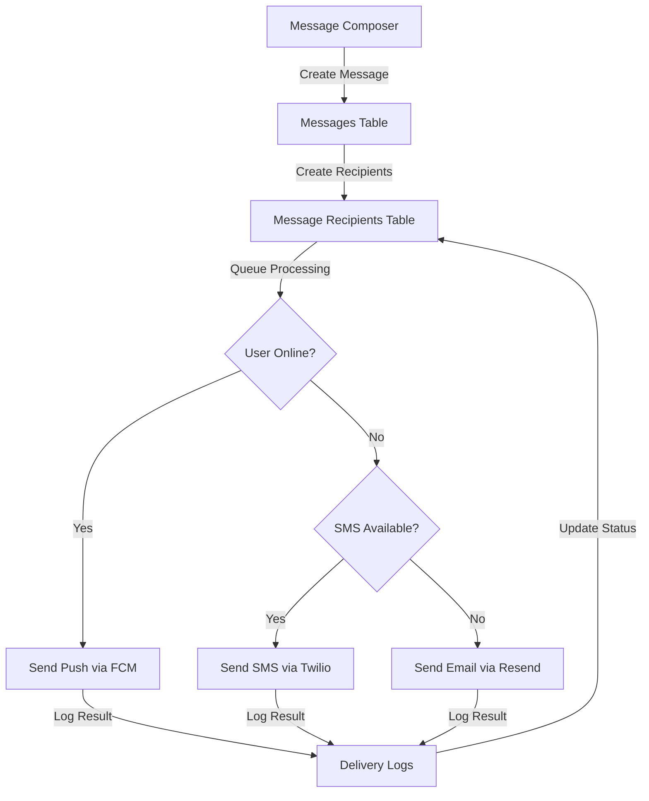

# School Announcements - Multi-Channel Notification System

A production-ready announcement and notification platform with multi-channel delivery, role-based access control, and comprehensive audit logging.

## Features

### Authentication & Roles

- ✅ Email/password authentication with automatic email confirmation
- ✅ Role-based access control (Admin, Teacher, Parent)
- ✅ Optional phone number verification for SMS delivery
- ✅ Secure profile management

### Message Composer

- ✅ Rich message creation with title, body, and optional links
- ✅ Audience targeting: All users, by role, by class, or individual
- ✅ Multi-channel selection: Push, SMS, and Email
- ✅ Delivery scheduling and recurrence (foundation in place)
- ✅ Message preview before sending

### Delivery System

- ✅ Intelligent multi-channel delivery with fallback handling
- ✅ Push notifications via Firebase Cloud Messaging (FCM)
- ✅ SMS delivery via Twilio (fallback for offline users)
- ✅ Email delivery via Resend or SMTP
- ✅ Delivery status tracking per channel
- ✅ Automatic retry logic (foundation in place)

### Notification Center

- ✅ Real-time message updates
- ✅ Read/unread status tracking
- ✅ Per-message delivery metadata
- ✅ Search and filter capabilities
- ✅ Mark as read functionality

### Admin Features

- ✅ Dashboard with delivery statistics
- ✅ User management overview
- ✅ System metrics and analytics
- ✅ Integration setup guides
- ✅ Audit logging (database schema ready)

### Security & Compliance

- ✅ Row Level Security (RLS) policies on all tables
- ✅ Encrypted phone number storage capability
- ✅ JWT-based authentication
- ✅ Input validation and sanitization
- ✅ Audit trail for all messages

## Technology Stack

- **Frontend**: React 18, TypeScript, Tailwind CSS, shadcn/ui
- **Backend**: Lovable Cloud (Supabase)
- **Database**: PostgreSQL with real-time subscriptions
- **Authentication**: Supabase Auth
- **Build Tool**: Vite

## Database Schema

### Core Tables

- `profiles` - User profiles with role and phone verification
- `classes` - Class/group organization
- `user_classes` - User-to-class relationships
- `messages` - Message metadata and content
- `message_recipients` - Delivery status per recipient
- `delivery_logs` - Per-channel delivery tracking
- `fcm_tokens` - Firebase push notification tokens

## Getting Started

### Prerequisites

- Node.js 18+ and npm
- Lovable Cloud account (automatically provisioned)

### Local Development

```bash
# Install dependencies
npm install

# Start development server
npm run dev
```

The app will be available at `http://localhost:8080`

### First-Time Setup

1. **Create an Account**: Visit `/auth` and sign up
2. **Choose Your Role**: Select Admin, Teacher, or Parent during registration
3. **Explore Features**:
   - Parents see the Notification Center
   - Teachers and Admins can compose and send messages
   - Admins have access to the Admin Dashboard

## Integration Setup

### Firebase Cloud Messaging (FCM) - Push Notifications

FCM is **free to use** for unlimited messages. Set up:

1. Create a Firebase project at [console.firebase.google.com](https://console.firebase.google.com)
2. Enable Cloud Messaging in Project Settings
3. Download your service account credentials
4. Add credentials to Lovable Cloud secrets:
   - `FIREBASE_PROJECT_ID`
   - `FIREBASE_CLIENT_EMAIL`
   - `FIREBASE_PRIVATE_KEY`

**Documentation**: [Firebase Cloud Messaging Setup](https://firebase.google.com/docs/cloud-messaging/js/client)

### Twilio SMS - SMS Delivery

Twilio offers a **free trial** with $15 credit for testing. Production requires paid account.

**Trial Limitations**:

- Can only send to verified phone numbers
- Messages include trial branding
- Limited to trial numbers you've verified

**Setup**:

1. Create account at [twilio.com/try-twilio](https://www.twilio.com/try-twilio)
2. Get your Account SID and Auth Token
3. Obtain a Twilio phone number
4. Add to Lovable Cloud secrets:
   - `TWILIO_ACCOUNT_SID`
   - `TWILIO_AUTH_TOKEN`
   - `TWILIO_PHONE_NUMBER`

**Pricing**: ~$0.0075-$0.015 per SMS (varies by country)  
**Documentation**: [Twilio SMS Quickstart](https://www.twilio.com/docs/sms/quickstart)

### Email Delivery - Resend

Resend offers **100 free emails per day** for testing.

**Setup**:

1. Sign up at [resend.com](https://resend.com)
2. Verify your sending domain
3. Create an API key
4. Add to Lovable Cloud secrets:
   - `RESEND_API_KEY`

**Documentation**: [Resend Email Quickstart](https://resend.com/docs)

## Environment Variables

All secrets are managed through Lovable Cloud and are automatically available to edge functions:

- `FIREBASE_PROJECT_ID` - FCM project ID
- `FIREBASE_CLIENT_EMAIL` - FCM service account email
- `FIREBASE_PRIVATE_KEY` - FCM private key
- `TWILIO_ACCOUNT_SID` - Twilio account identifier
- `TWILIO_AUTH_TOKEN` - Twilio authentication token
- `TWILIO_PHONE_NUMBER` - Your Twilio phone number (E.164 format)
- `RESEND_API_KEY` - Resend API key

## Backend Functions (Edge Functions)

Backend logic for message delivery, queue management, and webhook handling will be implemented as Supabase Edge Functions:

### Planned Functions

- `send-notification` - Main delivery orchestrator
- `fcm-send` - Firebase push notification sender
- `sms-send` - Twilio SMS sender
- `email-send` - Email delivery via Resend
- `delivery-webhook` - Twilio delivery status webhooks
- `retry-failed` - Automatic retry for failed deliveries

## Architecture

### Delivery Flow



### Security Model

- All tables have Row Level Security (RLS) enabled
- Users can only read their own profiles and messages
- Only Admins and Teachers can create messages
- Delivery logs are accessible only to message recipients
- Phone numbers stored with encryption capability

## Testing

### Manual Testing Checklist

- [ ] User registration with different roles
- [ ] Email authentication flow
- [ ] Phone number verification (if SMS configured)
- [ ] Message composition and sending
- [ ] Audience targeting (all, role-based)
- [ ] Multi-channel delivery selection
- [ ] Real-time notification updates
- [ ] Read/unread status tracking
- [ ] Admin dashboard statistics

### E2E Test Scenarios

- [ ] Offline user receives SMS fallback
- [ ] Push notification delivery to online users
- [ ] Email delivery when SMS unavailable
- [ ] Delivery retry after initial failure
- [ ] Webhook processing for status updates

## Deployment

### Frontend Deployment

1. Click **Publish** in Lovable editor (top right)
2. Frontend changes require clicking "Update" to go live
3. Custom domains can be connected in Project Settings

### Backend Deployment

- Edge functions deploy automatically with code changes
- No manual deployment needed for backend updates
- Database migrations require user approval before execution

## Monitoring & Observability

### Available Metrics

- Total users by role
- Messages sent (total count)
- Delivery success rate by channel
- Failed delivery count and reasons
- Average delivery time per channel

### Logging

- All delivery attempts logged in `delivery_logs` table
- Error messages captured for failed deliveries
- Audit trail maintained for all message sends

## Scaling Considerations

### Current Capacity

- Lovable Cloud scales automatically
- Database connections managed by Supabase
- Edge functions scale with traffic

### Optimization Recommendations

- Implement message batching for large audiences
- Add queue system with BullMQ for async processing
- Configure rate limiting per channel (FCM: 500k/day free tier)
- Monitor delivery logs and implement alerts

### Cost Estimates (Production)

- **Lovable Cloud**: Usage-based pricing (free tier available)
- **FCM**: Free (unlimited push notifications)
- **Twilio SMS**: ~$0.01 per message (US)
- **Resend Email**: Free for 100/day, $20/month for 50k/month

## Compliance & Regulations

### SMS Opt-Out

- Users can manage SMS preferences in profile settings
- Automatic handling of STOP/START keywords (implement in Twilio webhook)
- Opt-out state stored in profiles table

### Email Compliance

- Unsubscribe links should be added to all bulk emails
- Respect email preferences in user profiles
- Follow CAN-SPAM Act requirements

### Data Privacy

- Phone numbers stored securely (encryption ready)
- User data accessible only via RLS policies
- GDPR-compliant data deletion via cascade deletes

## Roadmap

### Phase 1 - Complete ✅

- [x] Authentication and role management
- [x] Message composer with audience targeting
- [x] Notification center with real-time updates
- [x] Database schema with RLS policies
- [x] Admin dashboard with statistics

### Phase 2 - In Progress 🚧

- [ ] FCM push notification integration
- [ ] Twilio SMS delivery with fallback
- [ ] Email delivery via Resend
- [ ] Queue system for background processing
- [ ] Delivery webhooks and status tracking

### Phase 3 - Planned 📋

- [ ] Message scheduling and recurrence
- [ ] Advanced audience filters (by class)
- [ ] Message templates
- [ ] Delivery analytics and reporting
- [ ] User opt-out management
- [ ] Automated retry with exponential backoff

## Support & Documentation

- **Lovable Cloud Docs**: [docs.lovable.dev/features/cloud](https://docs.lovable.dev/features/cloud)
- **Firebase FCM**: [firebase.google.com/docs/cloud-messaging](https://firebase.google.com/docs/cloud-messaging)
- **Twilio SMS**: [twilio.com/docs/sms](https://www.twilio.com/docs/sms)
- **Resend**: [resend.com/docs](https://resend.com/docs)

## License

This project is built with Lovable and follows standard web application licensing.

## Contributing

This is a Lovable-generated project. To contribute:

1. Connect your GitHub account in Lovable settings
2. Push changes to your connected repository
3. Changes sync automatically with Lovable

---

Built with ❤️ using [Lovable](https://lovable.dev)
